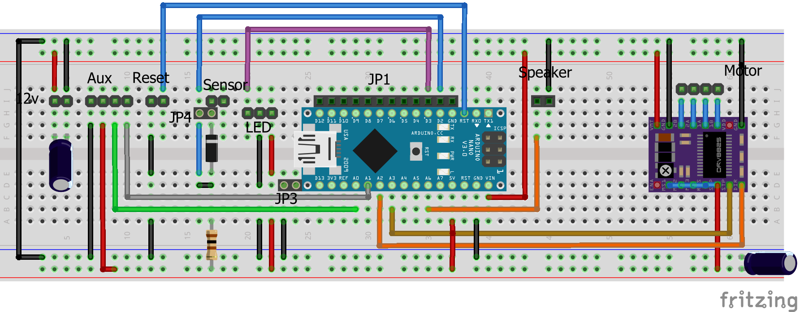

# BuzzzMas 2019
BuzzzMas is the Burgess/Kelly/Shearin project for the 2019 annual Christmas project.
This project takes inspiration from the [wire loop game](https://en.wikipedia.org/wiki/Wire_loop_game) 
and contains assets necessary for construction and operation.

## Required Parts
See [BOM.md](BOM.md)

## Schematic
From [StepperControllerV2.fzz](pcb/stepperController/StepperControllerV2.fzz)

## 3d Printed Parts
Required 3d printing are located [here](stl).

## Lasercut Parts
Cut [these](lasercut) parts if a laser cutter is available. The substitute 3d printed parts are also available
[here](stl)